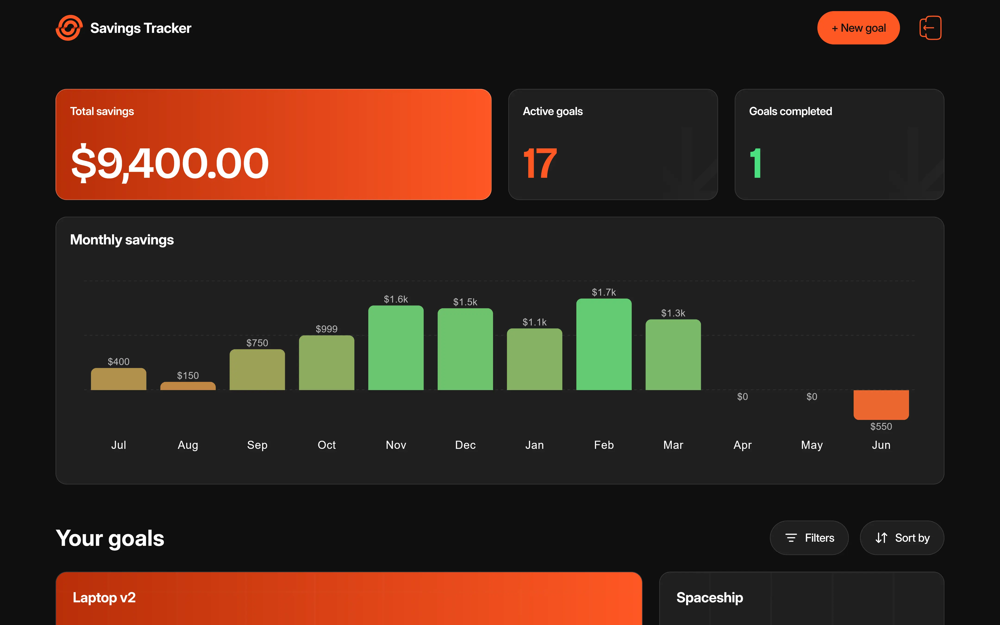
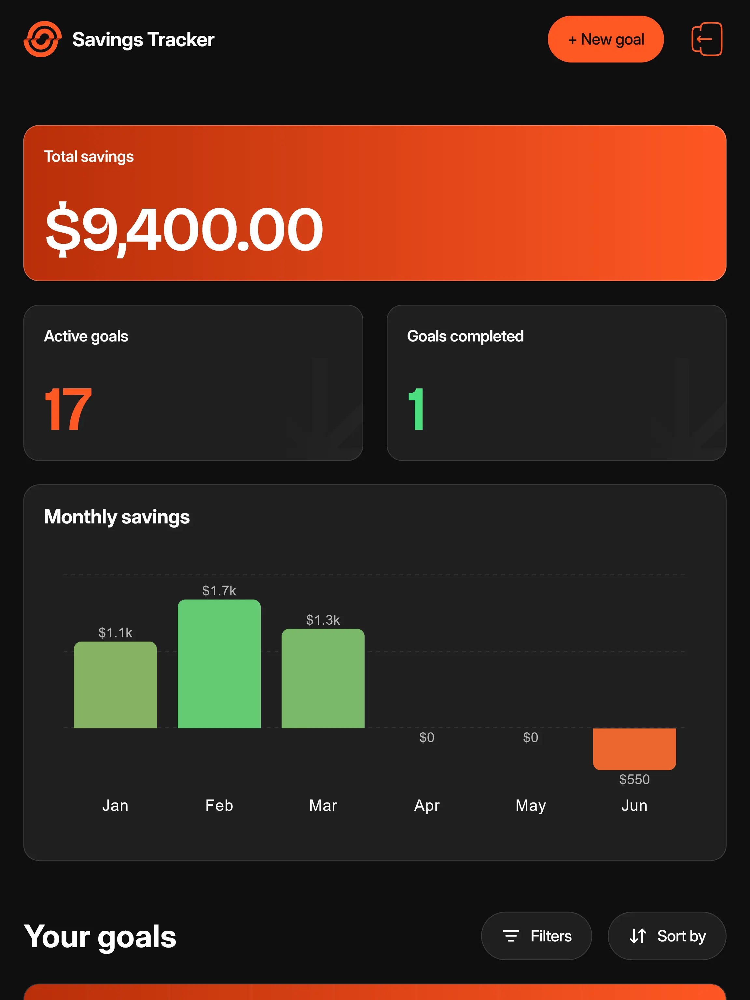
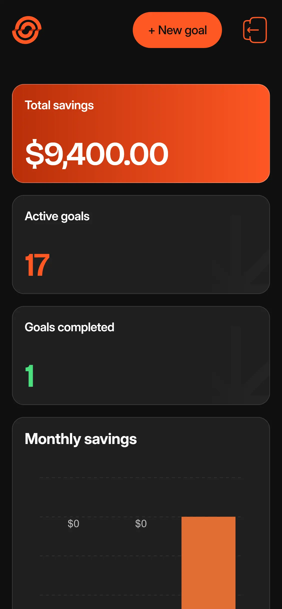

# Savings Tracker

> A full-stack savings tracker with goal management, deposit and withdrawal tracking, dashboard analytics, and authentication.



**Live Demo:** [savings-tracker-rrn.up.railway.app](https://savings-tracker-rrn.up.railway.app/)

---

## Overview

Savings Tracker is a full-stack application built as a Frontend Mentor challenge, extended into a complete solution with authentication, a PostgreSQL database, and a REST API. Users can create savings goals with optional deadlines, track deposits and withdrawals against each goal, and view their overall progress through a dashboard with summary stats and a monthly savings chart.

The project is structured as an npm workspaces monorepo with a React client, an Express server, and a shared package for types and validation schemas used across both.

---

## Features

### Authentication

- Register, log in, and log out with JWT-based sessions stored in HTTP-only cookies
- Forgot password flow with email-based reset tokens
- Strong password validation with real-time feedback

### Goal Management

- Create, edit, and delete savings goals with a name, target amount, and optional deadline
- Form validation with clear error messages for missing or invalid fields
- Distinct layout for completed goals

### Deposits & Withdrawals

- Add deposits and withdrawals to a goal with an amount and optional note
- View full transaction history per goal
- Withdrawal amounts validated against the current goal balance

### Dashboard

- Summary stats for total savings, active goals, and completed goals
- Monthly savings chart showing deposit and withdrawal activity over the last 12 months
- Goal cards showing progress, amounts, and deadlines
- Empty and completed states for goals

### Filtering & Sorting

- Filter goals by status (all, in progress, completed, not started)
- Sort by deadline, progress, amount saved, or alphabetically

### UI & Accessibility

- Responsive layout across mobile, tablet, and desktop
- Custom scroll areas and dropdowns built with Radix UI
- Hover and focus states for all interactive elements
- Keyboard navigable

---

## Tech Stack

| Category         | Technology                             |
| ---------------- | -------------------------------------- |
| Monorepo         | npm workspaces                         |
| Client Framework | React + Vite                           |
| Language         | TypeScript                             |
| Styling          | Tailwind CSS                           |
| Routing          | React Router                           |
| Data Fetching    | TanStack Query, Axios                  |
| Forms            | React Hook Form + Zod                  |
| Charts           | MUI X Charts                           |
| UI Components    | Radix UI                               |
| Server Framework | Express                                |
| Database         | PostgreSQL                             |
| Authentication   | Passport, JWT                          |
| Validation       | Zod (shared between client and server) |

---

## Project Structure

```
savings-tracker/
├── apps/
│   ├── client/                 # React + Vite frontend
│   │   └── src/
│   │       ├── app/            # Router, query client setup
│   │       ├── components/     # Shared UI components
│   │       ├── features/       # Feature modules (auth, dashboard)
│   │       ├── layouts/        # Route layouts
│   │       └── pages/          # Route pages
│   └── server/                 # Express backend
│       └── src/
│           ├── database/       # Schema, rollback, seeds
│           ├── includes/       # Config, db connection, passport
│           ├── middleware/     # Error handling, auth, rate limiting
│           └── modules/
│               ├── auth/       # Auth controllers, services, routes
│               └── dashboard/  # Goals and transactions
├── packages/
│   └── shared/                 # Shared types and Zod schemas
└── .github/workflows/          # CI pipeline
```

---

## Getting Started

### Prerequisites

- Node.js `v20+`
- PostgreSQL `v14+`

### Installation

```bash
git clone https://github.com/nofuenterr/savings-tracker.git
cd savings-tracker
npm install
```

### Environment Variables

Copy `.env.example` to `.env` in `apps/server` and fill in the required values:

```bash
cp apps/server/.env.example apps/server/.env
```

```env
NODE_ENV=development
PORT=3000

DATABASE_URL=
CLIENT_URL=http://localhost:5173

DB_HOST=localhost
DB_USER=postgres
DB_PASSWORD=
DB_NAME=savings_tracker
DB_PORT=5432

JWT_SECRET=
CSRF_SECRET=
COOKIE_SECRET=
```

### Database Setup

Create the database, then run migrations and seed data:

```bash
npm run migrate -w @savings-tracker/server
npm run seed -w @savings-tracker/server
```

To rollback (drop all tables):

```bash
npm run rollback -w @savings-tracker/server
```

### Running the App

```bash
# Run client and server together
npm run dev
```

The client runs at `http://localhost:5173` and the API at `http://localhost:3000`.

### Build

```bash
npm run build
```

---

## Screenshots

| Desktop                                                             | Tablet                                                            | Mobile                                                            |
| ------------------------------------------------------------------- | ----------------------------------------------------------------- | ----------------------------------------------------------------- |
|  |  |  |

---

## To-do

### In Progress / Upcoming

- [ ] Add pagination or infinite scroll to the goals list
- [ ] Lazy load goals list items
- [ ] Add more specific error messages on the error page
- [ ] Improve empty/no-data state design for the monthly savings chart
- [ ] Add unit and integration tests, and run them in CI
- [ ] Add animations and transitions
- [ ] Add drag-to-reorder for goals list
- [ ] Add profile feature (edit username, etc.)
- [ ] Add database indexes on frequently queried columns
- [ ] Resolve cross-origin cookie issue on iOS Safari (currently blocked despite `sameSite: 'none'`; considering alternatives to a custom domain or moving JWT storage off cookies)

### Completed

- [x] Create, edit, and delete savings goals with name, target amount, and optional deadline
- [x] Form validation messages for missing or invalid fields
- [x] Add deposits and withdrawals with amount and optional note
- [x] View full deposit and withdrawal history for each goal
- [x] Dashboard summary stats for total savings, active goals, and completed goals
- [x] Monthly savings chart showing activity over time
- [x] Goal card grid showing progress, amounts, and deadlines
- [x] Empty and completed states for goals
- [x] Filter goals by status and sort by deadline, progress, amount saved, or alphabetically
- [x] Goal detail page with progress percentage, remaining amount, and progress bar
- [x] Distinct completed layout when a goal reaches 100%
- [x] Responsive layout across screen sizes
- [x] Hover and focus states for interactive elements
- [x] Full keyboard navigation
- [x] Sign up, log in, and reset password via email
- [x] Rate limiting and security headers
- [x] Shared validation schemas between client and server

---

## Known Limitations

- **Password reset emails in production**: reset emails are sent via
  Gmail SMTP, which works in local development but is blocked by
  Railway's outbound network policy (SMTP ports are restricted to
  prevent abuse). In production, the reset link is logged to the
  server's output instead of being emailed. A production-ready fix
  would require an HTTP-based email provider (e.g., Resend, SendGrid)
  with a verified custom domain.

---

## Credits

This project is a solution to a [Frontend Mentor](https://www.frontendmentor.io) challenge. I do not own the rights to any assets used.

---

\*Developed by **RR Nofuente\***
